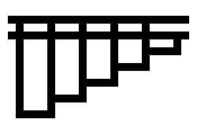
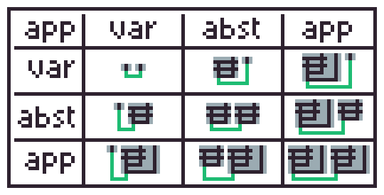
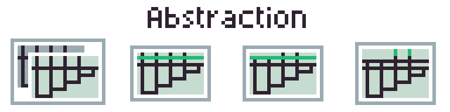


이 포스팅은 [lambda calculus](/posts/math/lambda-calculus)를 알고있다는 전제 하에 작성되었습니다.  




<div>


```
\f.\x.(f(f(f(f(fx)))))
```
</div>


[@tromp](https://github.com/tromp)가 고안한 lambda calculus를 시각화 하는 방법이다.
<https://tromp.github.io/cl/diagrams.html>


## Lambda Calculus Parsing

### Tokenizing

토큰 타입 목록, 토큰을 만든다.

다이어그램을 생성하는 것이 주 목적이기에, 문법은 간단하면서 렉싱하기 쉽게 만들었다.

### Parsing

파싱은 복잡하지 않게 제귀-하강 파싱(Recursive-descent parsing)을 사용했다.

그렇기에, **적용**을 무조건 괄호로 감싸야한다. 그러나, 연속적 **적용**은 하나의 괄호 내에 사용할 수 있다.

다음과 같은 타입으로 이루어진 AST를 생성한다.
```go
type AstLambdaExpr interface{}

type AstVariable struct {
	Name string
}

type AstAbstraction struct {
	Parameter AstVariable
	Body AstLambdaExpr
}

type AstApplication struct {
	Abstraction AstLambdaExpr
	Argument AstLambdaExpr
}
```

## Diagram 생성

### 생성 규칙

lambda calculus는 변수의 적용을 추상화로 감싸는 형태이기 때문에, 변수, 적용, 추상화 순으로 생성할 것이다.

 - Abstraction  
    가로선을 그린다.
 - Variable  
    해당 변수를 제공하는 abstraction 가로선까지 세로선을 그린다.
 - Application  
    추상화 대상에 해당하는 diagram을 왼쪽, 추상화 변수를 오른쪽 그리고, 각 좌하단에서 연결선을 그린다.
    

### 생성 방식

Lambda Calculus는 세가지 문법만으로 이루어진 것이 계층적으로 이루어져있는 것이기에, 제귀방식 생성을 택했다.  
상위 변수를 사용하는 경우가 있기 때문에, 이미지를 생성하는 것과 더불어 변수 목록을 함께 넘기는 struct 방식으로 생성할 것이다.

다음과 같은 다이어그램 interface와 struct들을 정의한다.

```go
type ExprDiagram interface {
	Img() image.Image
	Variables() []string
}

type VariDiag struct {
	img  image.Image
	name string
}
...

type AbstDiag struct {
	img image.Image
	variable string
	variables []string
}
...

type AppDiag struct {
	img image.Image
	variables []string
}
...
```


#### Variable Diagram

변수 다이어그램은 단순히 확장 가능한 세로선을 생성한다.  
변수 목록은 자신 하나만 들어있는 array로 한다.  

```go
func GenVariDiag(variable AstVariable) VariDiag {
	img := image.NewRGBA(image.Rect(0, 0, 3, 2))

	img.Set(1, 0, color.Black)
	img.Set(1, 1, color.Black)

	return VariDiag{
		img:  img,
		name: variable.Name,
	}
}
```

#### Application Diagram

적용 다이어그램은 위의 [생성 규칙](#생성-규칙)에 따라 배열하고, 선을 긋는다.  
변수 목록은 타겟-인자 순으로 concatenate한 array로 한다.



```
((\a.\b.(a n))(\a.\b.(a n)))
```


***

```go
func GenAppDiag(expr AstApplication) AppDiag {
	// generate target, argument diagram
    ...
	// calculate application image bound
    ...
	// draw target diagram
    ...
	// draw extended target line
    ...
	// draw argument diagram
    ...
	// draw extended argument line
    ...
	// draw application line
    ...
    // concatenate target and argument variables list
	return AppDiag{
		img: img,
		variables: append(
            targDiagram.Variables(),
            argDiagram.Variables()...
        ),
	}
}
```

#### Abstraction Diagram

변수를 할당하는 가로선을 긋고, 변수 목록에서 일치하는 변수 세로선은 제거한다.



```
\a.\b.(a a n n b)
```


***

```go
func GenAbstDiag(abst AstAbstraction) AbstDiag {
    // generate abstraction target diagram
    ...
    // create new editable image
    ...
    // draw abstraction line (horizontal)
    ...
	// remove matching variables (vertical)
	var variables []string
    ...
    // extend variable line
    ...
    return AbstDiag{
        img: wrap,
        variables: variables,
    }
}
```

## Related

 - [What is PLUS times PLUS? - 2swap (Youtube)](https://youtu.be/RcVA8Nj6HEo)
 - <https://tromp.github.io/cl/diagrams.html>
 - <https://cruzgodar.com/applets/lambda-calculus/>
 - <https://github.com/ywbird/lambda-diagram>
 - <https://ywbird.github.io/ppt.old/lambda-ppt>
