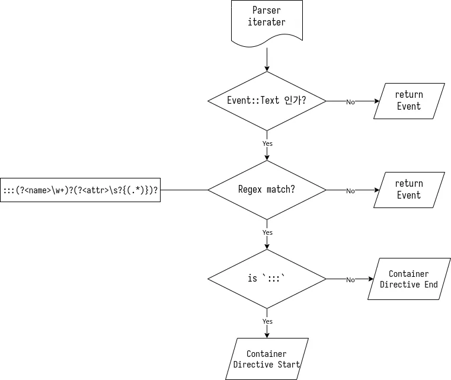

## remark-directive

directive는 아래와 같이 기본 마크다운을 확장하는 기능이다.  
기본 remarkjs에서 공식으로 지원한다.  
[remarkjs/remark-directive](https://github.com/remarkjs/remark-directive)

```markdown
:h[HIGH]{.font-mono.red.l}:h[LIGHT]{.font-mono.blue.l}

:h[A]{.font-mono.red.l}
:h[M]{.font-mono.green.l}
:h[A]{.font-mono.blue.l}
:h[Z]{.font-mono.yellow.l}
:h[I]{.font-mono.red.l}
:h[N]{.font-mono.green.l}
:h[G]{.font-mono.blue.l}
```

:::details{summary="🔎 Result HTML"}

```html
<span class="font-mono red l highlight">HIGH</span>
<span class="font-mono blue l highlight">LIGHT</span>

<span class="font-mono red l highlight">A</span>
<span class="font-mono green l highlight">M</span>
<span class="font-mono blue l highlight">A</span>
<span class="font-mono yellow l highlight">Z</span>
<span class="font-mono red l highlight">I</span>
<span class="font-mono green l highlight">N</span>
<span class="font-mono blue l highlight">G</span>
```

:::

:h[HIGH]{.font-mono.red.l}:h[LIGHT]{.font-mono.blue.l}

:h[A]{.font-mono.red.l}
:h[M]{.font-mono.green.l}
:h[A]{.font-mono.blue.l}
:h[Z]{.font-mono.yellow.l}
:h[I]{.font-mono.red.l}
:h[N]{.font-mono.green.l}
:h[G]{.font-mono.blue.l}

```markdown
:::note
This is note
:::
```
:::details{summary="🔎 Result HTML"}

```html
<aside aria-label="note" class="admonition" data-admonition-type="note">
  <p class="admonition-title" aria-hidden="true">note</p>
  <div class="admonition-content">
    <p>This is note</p>
  </div>
</aside>
```

:::

:::note
This is note
:::

---

그러나, pulldown-cmark에서는 지원하지 않기에, 직접 구현해보려한다.

## Idea

Directive는 크게 세가지 종류가 있다.  
 - Text Directive
 - Leaf Directive
 - Container Directive
 
`Text directive`는 위에서 보여준 :h[HIGH]{.font-mono.red.l}:h[LIGHT]{.font-mono.blue.l} 이고,  
`container directive`는 아래의 노트 기능 등, 하나의 블럭을 말한다.

:::note
`Leaf directive`는 `text directive`와 거의 비슷하지만, 한 줄로 분리되어 취급된다는 차이점이 있다.  
따라서 현재 필요성을 못 느끼고 있기 때문에, 일단은 구현하지 않을예정
:::

먼저 가장 많이 쓰고있는 container directive를 구상해보자.  

### Container Directive

#### 구체적 문법
 
아래처럼 `:::`로 둘러싸여 있는 블럭에 `:::`뒤에 블럭 이름, `{}`로 감싸진 attributes를 넣으면 HTML 태그로 만들어지지는,  
  
않고, 추후 mdast를 이용한 remark 플러그인들이 접근할 수 있는 mdast 객체로 반환한다.

```markdown
:::lemon{.banana.kiwi title="apple"}
Hello World
:::
```

```js
{
  type: 'containerDirective',
  name: 'lemon',
  attributes: { class: 'banana kiwi', title: 'apple' },
  children: [ { type: 'paragraph', children: [Array], position: [Object] } ],
  position: {
    start: { line: 103, column: 1, offset: 2197 },
    end: { line: 105, column: 4, offset: 2253 }
  }
}
```

이경우, `:::`를 기준으로 stack에서 push, pop을 하면 될 듯 하다.

아래 정규 표현식에 아래 조건에 부합하고 `:::`가 아니면, container directive 시작,
```regex
:::(?<name>\w+)?(?<attr>\s?{(.*)})?
```

그냥 `:::`이면 container directive 끝으로 보멸 될 것 같다.

1. 위 정규 표현식에 맞는 `Event::Text`를 검출한다. `:::`이면 closing, `:::` 이외에 내용이 있다면 opening으로 판별한다.  
2. Container directive가 시작되면 directive 설정 내용을 resolve하여 새로운 `Directive` 객체를 생성하고, `open` 함수를 호출한다.  
3. `open`함수는 directive에 설정된 tag attriute가 있다면 해당 tag로 opening tag를 생성, 나머지 attributes를 태그에 넣는다.  
4. `Directive` 객체를 복사하여 `Vec`에 `push`한다.  



```rs
pub struct DirectivePlugin {
    stack: Vec<Directive>
}

impl DirectivePlugin {
    pub fn new() -> Self {
	Self {
	    stack: Vec::new()
	}
    }

    pub fn apply(&mut self) -> impl FnMut(Event<'_>) -> Event<'_> + use<'_> {
	return |event| {
	    match &event {
		Event::Text(text) => {
		    let re = Regex::new(r#":::(?<name>\w+)?\s?(?<attr>\{(.*)\})?"#).unwrap();
		    if !re.is_match(&text) { return event; }
		    let prefix = ":::".to_string();
		    if prefix == text.to_string() {
			if self.stack.len() >= 1 {
			    return Event::Html(self.stack.pop().unwrap().close().into());
			}
		    } else {
			let new_directive = resolve_directive(&text.to_string());
			self.stack.push(new_directive.clone());
			return Event::Html(new_directive.open().into());
		    }
		},
		_ => (),
	    };

	    event
	}
    }
}
```

```rs
#[derive(Debug, Clone)]
struct Directive {
    name: String,
    tag_name: String,
    // attributes: String,
    attributes: HashMap<String, String>,
}

impl Directive {
    pub fn open(&self) -> String {
	let mut tag = "<".to_string();
	write!(&mut tag, "{} ", self.tag_name);
	write!(&mut tag, "data-name=\"{}\" ", self.name);
	for (key, val) in self.attributes.iter() {
	    write!(&mut tag, "{}=\"{}\" ", key, val);
	}
	write!(&mut tag, ">");
	tag
    }

    pub fn close(&self) -> String {
	let mut tag = "</".to_string();
	write!(&mut tag, "{}", self.tag_name);
	write!(&mut tag, ">");
	tag 
    }
}
```


최종 코드:
```rs
#[derive(Debug, Clone)]
struct Directive {
    name: String,
    tag_name: String,
    // attributes: String,
    attributes: HashMap<String, String>,
}

impl Directive {
    pub fn open(&self) -> String {
	let mut tag = "<".to_string();
	write!(&mut tag, "{} ", self.tag_name);
	write!(&mut tag, "data-name=\"{}\" ", self.name);
	for (key, val) in self.attributes.iter() {
	    write!(&mut tag, "{}=\"{}\" ", key, val);
	}
	write!(&mut tag, ">");
	tag
    }
	
    pub fn close(&self) -> String {
	let mut tag = "</".to_string();
	write!(&mut tag, "{}", self.tag_name);
	write!(&mut tag, ">");
	tag 
    }
}

pub struct DirectivePlugin {
    stack: Vec<Directive>
}

impl DirectivePlugin {
    pub fn new() -> Self {
	Self {
	    stack: Vec::new()
	}
    }

    pub fn apply(&mut self) -> impl FnMut(Event<'_>) -> Event<'_> + use<'_> {
	return |event| {
	    match &event {
		Event::Text(text) => {
		    let re = Regex::new(r#":::(?<name>\w+)?\s?(?<attr>\{(.*)\})?"#).unwrap();
		    if !re.is_match(&text) { return event; }
		    let prefix = ":::".to_string();
		    if prefix == text.to_string() {
			if self.stack.len() >= 1 {
			    return Event::Html(self.stack.pop().unwrap().close().into());
			}
		    } else {
			let new_directive = resolve_directive(&text.to_string());
			self.stack.push(new_directive.clone());
			return Event::Html(new_directive.open().into());
		    }
		},
		_ => (),
	    };

	    event
	}
    }
}

fn resolve_directive(start: &String) -> Directive {
    let re = Regex::new(r#":::(?<name>\w+)?\s?(\{(?<attr>.*)\})?"#).unwrap();
    let result = re.captures(start).unwrap();
    let name = match result.name("name") {
	Some(s) => s.as_str().to_string(),
	None => "div".to_string()
    };
    let raw_attrs = match result.name("attr") {
	Some(s) => s.as_str(),
	None => ""
    };
    let mut tag_name = "div".to_string();
    let mut attributes: HashMap<String, String> = HashMap::new();
    attributes.insert("class".to_string(), "".to_string());
    for term in raw_attrs.split_whitespace() {
	let re_class_id = Regex::new(r#"(\.[a-z0-9\-]+)+"#).unwrap();
	let re_val = Regex::new(r#"(?<name>[a-z\-]*)\=\"(?<val>.*)\""#).unwrap();

	if re_class_id.is_match(&term) {
	    let re_item = Regex::new(r#"\.(?<name>[a-z0-9\-]+)"#).unwrap();
	    for (_, [name]) in re_item.captures_iter(&term).map(|c| c.extract()) {
		if attributes.get("class").unwrap().len() != 0 {
		    attributes.get_mut("class").unwrap().push_str(" ");
		}
		attributes.get_mut("class").unwrap().push_str(name);
	    }
	} else if re_val.is_match(&term) {
	    let (_, [key, value]) = re_val.captures(&term).unwrap().extract();
	    if key == "tag" {
		tag_name = value.to_string();
	    } else {	
		attributes.insert(key.to_string(), value.to_string());
	    }
	}
    }
    return Directive {
	name,
	tag_name,
	attributes,
    }
}
```

